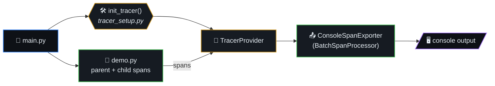
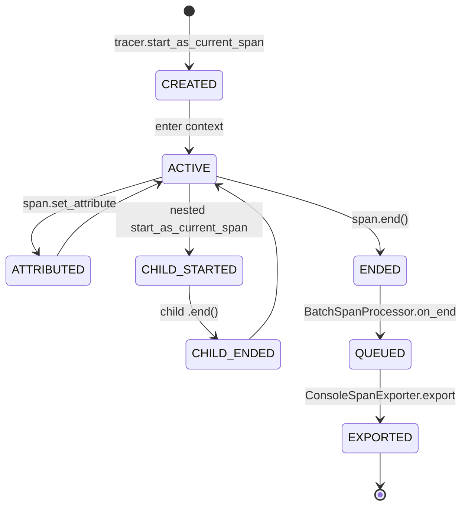
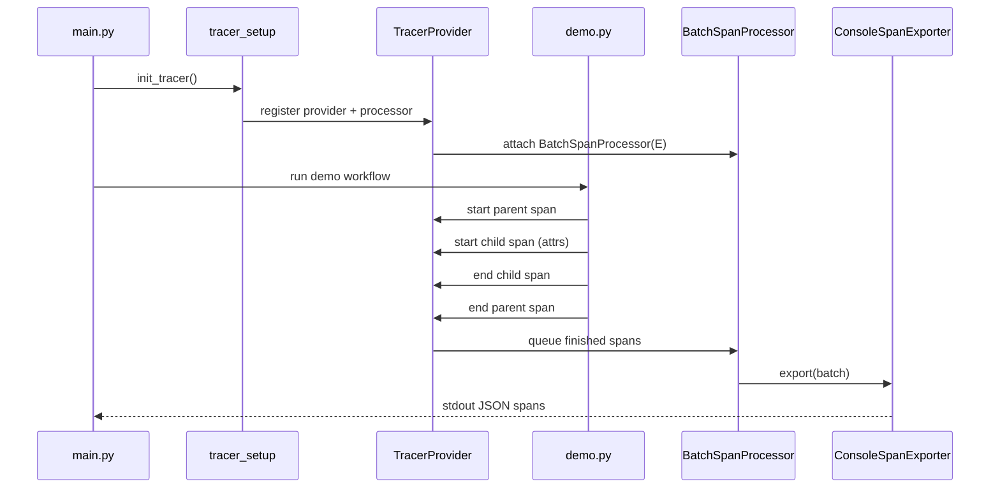
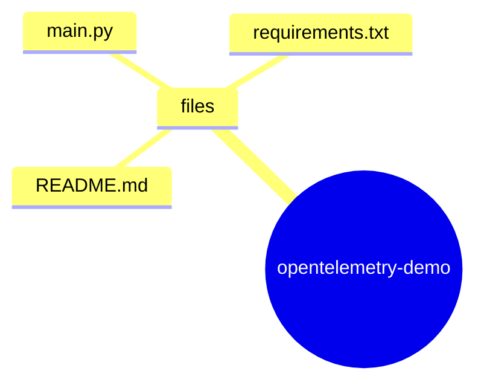

# OpenTelemetry Python Demo

> Minimal OpenTelemetry (traces) demo in Python: one parent span, one
> child span, console export.



## Table of contents

- [Setup](#setup)
- [Trace flow (sequence)](#trace-flow-sequence)
- [Span lifecycle (state)](#span-lifecycle-state)
- [Run](#run)
- [Layout](#layout)
- [Author](#author)
- [🗺️ Repository map](#️-repository-map)

## Span lifecycle (state)



## Trace flow (sequence)



## Setup

1. Create and activate a virtual environment (recommended):

   ```bash
   python3 -m venv .venv
   source .venv/bin/activate   # Linux/macOS
   ```

2. Install dependencies:

   ```bash
   pip install -r requirements.txt
   ```

## Run

From the repo root:

```bash
python main.py
```

Spans are printed to the console (BatchSpanProcessor + ConsoleSpanExporter).

## Layout

- `tracer_setup.py` – TracerProvider, console exporter, `init_tracer()` / `get_tracer()`
- `demo.py` – Demo workflow (parent/child spans and attributes)
- `main.py` – Entrypoint: init tracer, run demo

## Author

Misha Lubich, michaelle.lubich@gmail.com  
GitHub: https://github.com/ml-lubich


## 🗺️ Repository map

Top-level layout of `opentelemetry-demo` rendered as a Mermaid mindmap (auto-generated from the on-disk tree).


